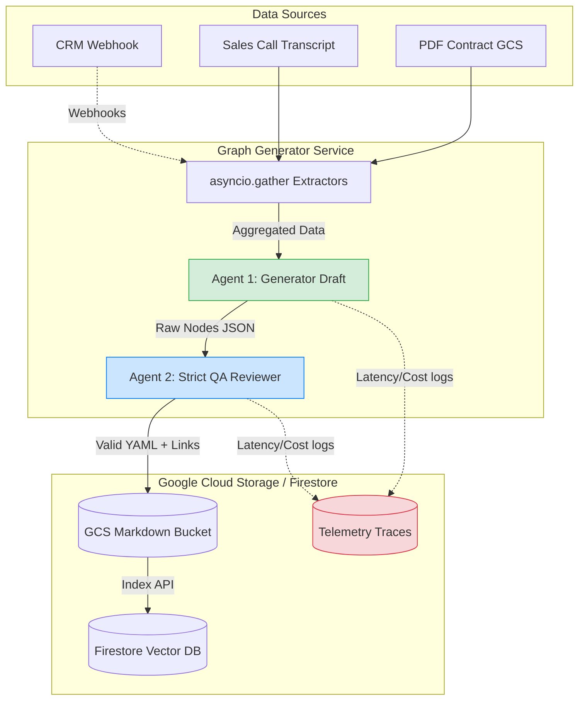

# Synapse — Architecture

## Multimodal Live Agent Flow (Vision + Voice)

This sequence demonstrates how our React frontend captures desktop screen shares (Vision) and microphone audio (Voice), and proxies them through our FastAPI Google Cloud Run backend into the **Gemini 2.0 Flash Multimodal Live API**.

```mermaid
sequenceDiagram
    participant User as User (CSM/Sales/Support)
    participant React as Frontend (Voice UI)
    participant FastAPI as Backend (Synapse API)
    participant Hub as Hub API
    participant Gemini as Gemini Live API
    participant Graph as Firestore Skill Graph

    User->>React: Selects Role (CSM/Sales/Support/Winback)
    React->>FastAPI: Connect (tenant_id, role)
    FastAPI->>Hub: Get Tenant Config (branding, prompts)
    Hub-->>FastAPI: Config Data
    
    React->>React: Capture Audio/Vision
    React->>FastAPI: WebSocket: {"type": "audio", "data": "<base64>"}
    # ... forwarded to Gemini
    
    activate FastAPI
    FastAPI->>Gemini: Forward Audio (mime_type: audio/pcm) 
    FastAPI->>Gemini: Forward Image (mime_type: image/jpeg)
    
    activate Gemini
    Gemini-->>Gemini: Multimodal Synthesis & Reasoning
    
    rect rgb(200, 220, 240)
        Note right of Gemini: Agentic Tool Use (Grounding)
        Gemini->>FastAPI: Tool Call: search_graph("revenue trends")
        FastAPI->>Graph: Firestore Vector Search (FindNearest)
        Graph-->>FastAPI: Top 3 Markdown Nodes
        FastAPI-->>Gemini: Tool Result (Node Content)
    end
    
    Gemini-->>FastAPI: Output Audio (mime_type: audio/pcm)
    deactivate Gemini
    
    FastAPI-->>React: WebSocket {"type": "audio", "data": "<base64>"}
    deactivate FastAPI
    
    React-->>CSM: Plays Audio Contextualized to the Screen
    deactivate React
```

---

## ETL Graph Generation Pipeline (Multi-Agent)

This diagram outlines how raw CRM data and Salesforce transcripts are parsed by a dual-agent team into a deterministic Markdown Skill Graph.



## Gemini Models Used

| Model | Purpose | Where Used |
|---|---|---|
| `gemini-3.1-pro-preview` | Entity extraction + node generation | Graph Generator |
| `gemini-embedding-001` | 768d vector embeddings for search | Graph Generator, Backend |
| `gemini-2.5-flash-native-audio-preview` | Real-time voice (Multimodal Live API) | Backend Live Sessions |
| `gemini-3.0-flash` | Fallback / summaries | Backend (optional) |

## Technology Stack

| Layer | Technology |
|---|---|
| **Frontend** | React 19, Vite 6, TypeScript 5, React Flow |
| **Backend API** | Python 3.11, FastAPI, WebSockets |
| **Graph Generator** | Python 3.11, FastAPI, Google GenAI SDK |
| **Infrastructure** | Terraform, Google Cloud (Cloud Run, GCS, Firestore, Secret Manager) |
| **AI** | Gemini 3.1 Pro, Gemini Embedding 001, Gemini 2.5 Flash Native Audio |
| **IaC** | Terraform modules (storage, firestore, cloud-run, firebase) |

## Project Structure

```
synapse/
├── hub/                        # Synapse Hub (Tenant Config Portal)
│   ├── api/                    # Hub CRUD API
│   └── src/                    # Hub React Frontend
├── backend/                    # Synapse API (Core Voice Service)
│   ├── main.py                 # Multi-tenant session handler
│   ├── agent/                  # Multi-role prompt engine
│   └── core/                   # Shared logic (via symlink/mount)
├── graph-generator/            # Delta Graph Generator (Account-oriented)
│   ├── main.py                 # Asynchronous pipeline
│   └── node_generator.py       # Entity -> Delta Node logic
├── crm-simulator/              # Mock CRM (SalesClaw)
│   ├── main.py                 # Entity webhooks
│   └── frontend/               # Kanban Interface
├── frontend/                   # Synapse Voice UI (Multi-role)
│   └── src/                    # Briefing Session flow
├── core/                       # Shared Domain Models & Config
├── infra/                      # Terraform (Cloud Run, GCS, Firestore)
└── scripts/                    # Automation (start-local.ps1, deploy.sh)
```
