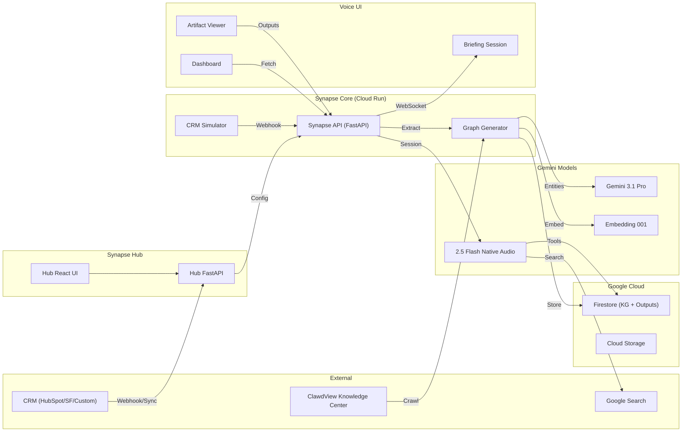
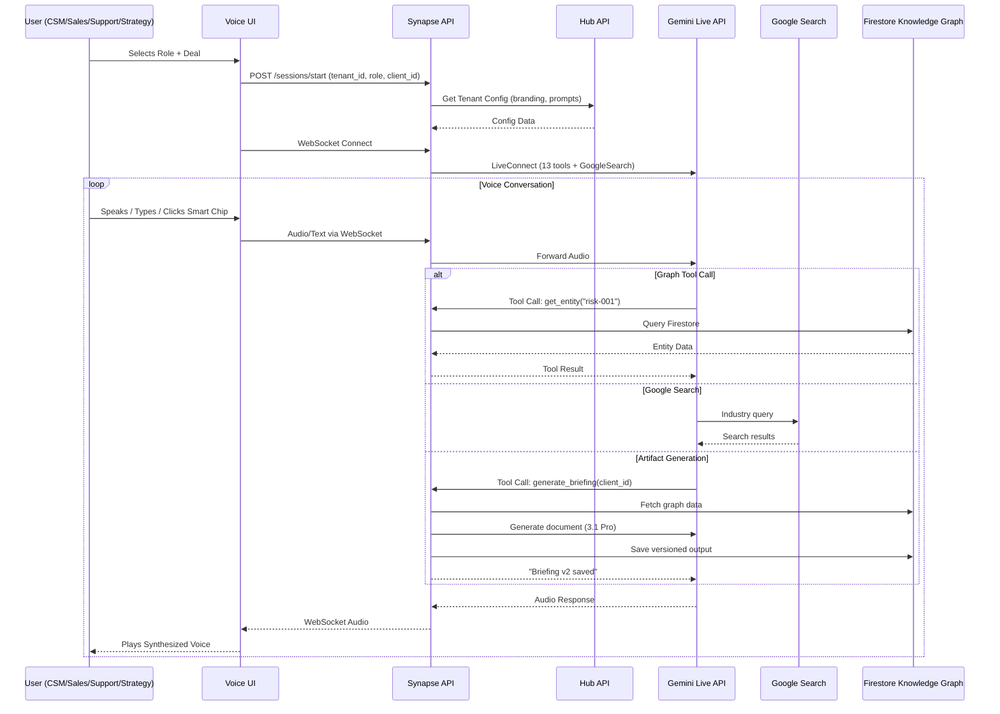
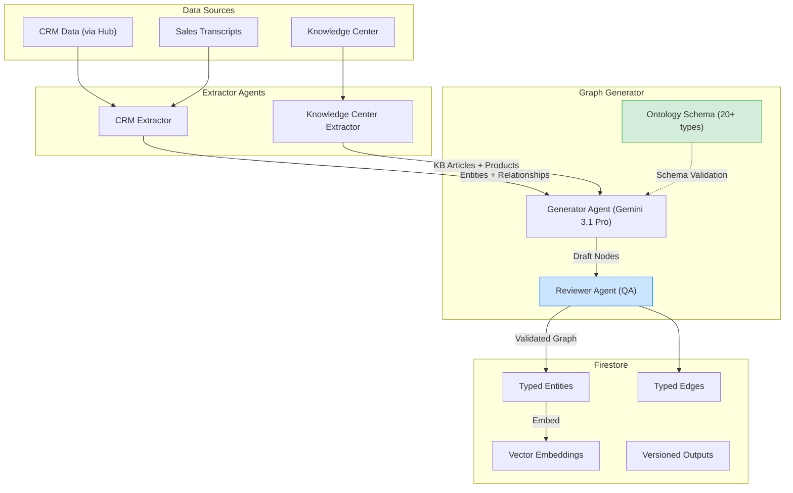

# Synapse — Architecture

## System Overview



---

## Multimodal Live Agent Flow



---

## Ontology-Driven Graph Pipeline



### Entity Types (Ontology)

| Category | Types |
|---|---|
| **Core** | Client, Deal, Contact, Account |
| **Product** | Product, Feature, Limitation, Integration |
| **Risk** | Risk, CompetitorThreat, ChurnSignal |
| **Strategy** | SuccessMetric, Milestone, Timeline |
| **Knowledge** | KBArticle, BestPractice, UseCase |

### Edge Types

| Edge | From → To | Description |
|---|---|---|
| `HAS_RISK` | Client → Risk | Client-level risk |
| `INCLUDES` | Deal → Product | Products in deal |
| `CHAMPIONS` | Contact → Deal | Stakeholder advocacy |
| `USES_PRODUCT` | Client → Product | Current product usage |
| `MITIGATED_BY` | Risk → Feature | Risk mitigation |
| `DEPENDS_ON` | Integration → Product | Technical dependency |
| `COMPETES_WITH` | Product → Competitor | Competitive landscape |

---

## Gemini Models Used

| Model | Purpose | Where Used |
|---|---|---|
| `gemini-3.1-pro-preview` | Entity extraction, node generation, document generation | Graph Generator, Output Generators |
| `gemini-embedding-001` | 768d vector embeddings for semantic search | Graph Generator, Backend |
| `gemini-2.5-flash-native-audio-preview` | Real-time voice (Multimodal Live API) | Backend Live Sessions |
| Google Search Grounding | Industry context, competitor data, market trends | Live Sessions (supplementary) |

---

## Technology Stack

| Layer | Technology |
|---|---|
| **Frontend** | React 19, Vite 6, TypeScript 5, React Flow |
| **Backend API** | Python 3.11, FastAPI, WebSockets |
| **Hub** | React + FastAPI (multi-tenant config portal) |
| **Graph Generator** | Python 3.11, FastAPI, Google GenAI SDK |
| **Knowledge Center** | Static HTML/CSS (ClawdView product docs) |
| **Infrastructure** | Terraform, GCP (Cloud Run, GCS, Firestore, Secret Manager) |
| **AI** | Gemini 3.1 Pro, Embedding 001, 2.5 Flash Native Audio, Google Search |

---

## Project Structure

```
synapse/
├── hub/                        # Synapse Hub (Multi-Tenant Config Portal)
│   ├── api/                    # Hub CRUD API (tenants, field mapping)
│   └── src/                    # Hub React Frontend
├── backend/                    # Synapse API (Core Voice Service)
│   ├── main.py                 # FastAPI + 30+ endpoints
│   ├── agent/                  # ADK Agent Engine
│   │   ├── prompts.py          # 4 role prompts + search policy
│   │   ├── tools.py            # 13 tool definitions + wrappers
│   │   └── synapse_agent.py    # Agent runner
│   ├── graph/                  # Knowledge Graph Engine
│   │   ├── ontology.py         # 20+ entity types, edge schema
│   │   ├── traversal.py        # Multi-hop typed traversal
│   │   ├── search.py           # Semantic search + type filters
│   │   └── outputs.py          # 7 generators, 6 transcripts, versioning
│   └── live/                   # Gemini Live Sessions
│       └── session.py          # Voice + GoogleSearch + 13 tools
├── graph-generator/            # Graph Generator (Ontology Pipeline)
│   ├── extractors/
│   │   ├── crm_extractor.py    # CRM entity extraction
│   │   └── kc_extractor.py     # Knowledge Center extraction
│   └── main.py                 # Dual-pipeline orchestrator
├── knowledge-center/           # ClawdView Static Knowledge Site
├── crm-simulator/              # Mock CRM (SalesClaw)
├── frontend/                   # Synapse Voice UI
│   └── src/components/
│       ├── Dashboard.tsx        # Deal cards + artifact badges
│       ├── BriefingSession.tsx  # Voice session orchestrator
│       ├── ConversationPanel.tsx # Smart action chips + transcript
│       ├── ArtifactViewer.tsx   # Version history + preview
│       └── GraphPanel.tsx       # Typed entity visualization
├── core/                       # Shared Config + DB
├── infra/                      # Terraform (4 modules)
└── scripts/                    # deploy.ps1, start-local, teardown
```
