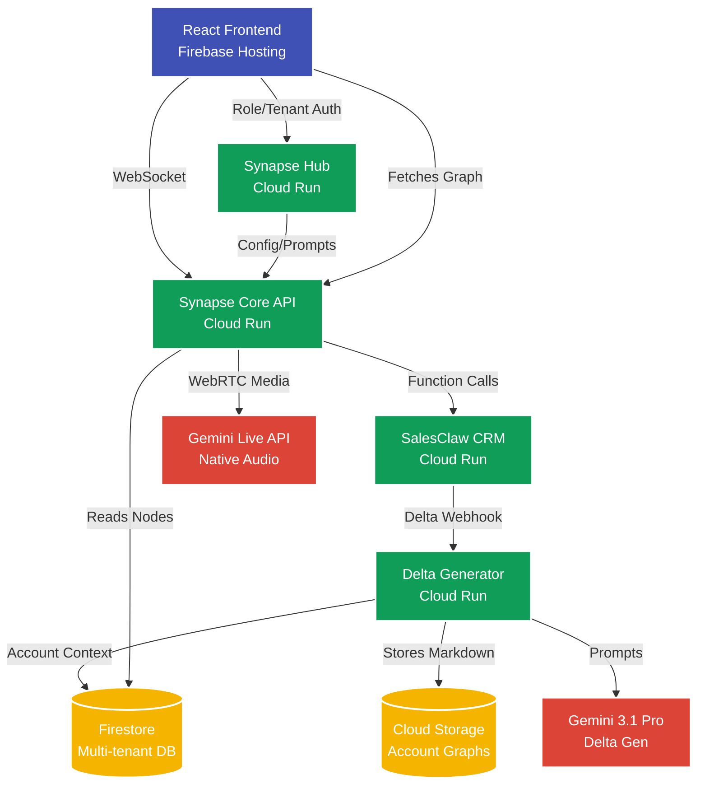

# 🏗️ Synapse Infrastructure Architecture

Synapse is designed to run in a production-ready, highly available **Google Cloud Platform (GCP)** environment. All infrastructure is provisioned strictly through **Terraform**, ensuring reproducible, idempotent deployments.

## Component Overview

---

## 1. Firebase Hosting (Frontend)
The React SPA (Single Page Application) is compiled to static HTML/CSS/JS and deployed globally via Firebase Hosting's CDN. This guarantees low latency for users globally.

## 2. Google Cloud Run (Compute Layer)
We utilize fully managed serverless containers for our backend logic. They automatically scale from 0 to N based on traffic.
* **`synapse-api`**: Powers the REST endpoints and the real-time WebSockets/WebRTC bridging to Gemini Live.
* **`synapse-graph-generator`**: Evaluates async Webhooks from the CRM. Due to complex multi-agent execution times, the timeout for this service is explicitly raised to `900s`.
* **`synapse-crm-simulator`**: A mock CRM holding demo data. Plugs into the architecture identically to Salesforce or Hubspot.

## 3. Storage & Databases
* **Google Cloud Storage (GCS)**: Stores the raw generated Markdown files representing individual context blocks (Nodes).
* **Google Firestore**: NoSQL document DB. Maintains the relational edges between nodes and houses the **Vector Index** to rapidly query 768-dimensional `gemini-embedding` vectors.

## 4. Terraform (`infra/`)
Our IaC stack handles everything securely:
- Creates GCS Buckets with proper IAM.
- Deploys Cloud Run services mapping to Docker images stored in GCP Artifact Registry.
- provisions Google Secret Manager to securely pass the `GEMINI_API_KEY` to the containers at runtime.
