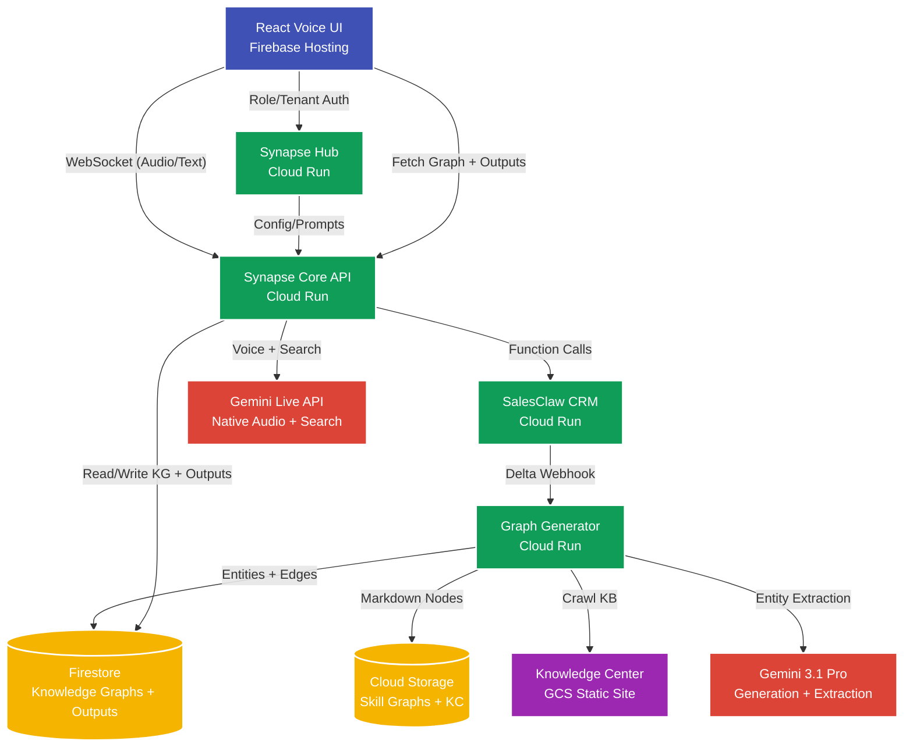

# 🏗️ Synapse Infrastructure Architecture

Synapse is designed to run in a production-ready, highly available **Google Cloud Platform (GCP)** environment. All infrastructure is provisioned through **Terraform**, ensuring reproducible, idempotent deployments.

## Component Overview



---

## 1. Firebase Hosting (Frontend)
The React SPA is compiled to static HTML/CSS/JS and deployed globally via Firebase Hosting's CDN. Low latency for users worldwide.

## 2. Google Cloud Run (4 Compute Services)

| Service | Purpose | Timeout | Min Instances |
|---|---|---|---|
| `synapse-api` | REST API + WebSocket/WebRTC bridge to Gemini Live | 300s | 1 |
| `synapse-graph-generator` | Async multi-agent entity extraction pipeline | 900s | 0 |
| `synapse-crm-simulator` | Mock CRM with webhook support | 60s | 0 |
| `synapse-hub` | Multi-tenant config portal (React + API) | 60s | 0 |

All services use Docker images stored in **GCP Artifact Registry** and are built via **Cloud Build** (`cloudbuild.yaml`).

## 3. Storage & Databases

| Resource | Purpose |
|---|---|
| **Firestore** | Knowledge graphs (entities + edges), vector index (768d embeddings), versioned outputs, session state |
| **GCS (Skill Graphs)** | Raw Markdown knowledge nodes |
| **GCS (Knowledge Center)** | ClawdView static site — product docs, features, KB articles |
| **Secret Manager** | `GEMINI_API_KEY` securely injected at runtime |

## 4. Knowledge Center (GCS Static Site)

The ClawdView Knowledge Center is deployed as a static website on GCS:
- Bucket: `{project_id}-knowledge-center`
- Configured with `index.html` / `404.html` web serving
- Public read access via `allUsers:objectViewer`
- Content synced via `gsutil -m rsync` during deployment
- Used by the Graph Generator's Knowledge Center Extractor for product knowledge extraction

## 5. Terraform Modules (`infra/`)

| Module | Resources Created |
|---|---|
| `storage` | GCS buckets (skill-graphs, uploads, knowledge-center) with IAM |
| `firestore` | Firestore database (native mode) with vector index |
| `cloud-run` | 4 Cloud Run services, Artifact Registry, IAM bindings |
| `firebase` | Firebase Web App + Hosting configuration |

## 6. Deployment Pipeline (`scripts/deploy.ps1`)

The one-click deployment script executes 5 phases:

```
[1/5] gcloud auth check + generate deploy tag
[2/5] Build CRM + Hub frontends → Cloud Build (cloudbuild.yaml)
[3/5] Terraform init + apply → creates/updates all GCP resources
[4/5] gsutil rsync → deploys Knowledge Center to GCS static site
[5/5] npm build → firebase deploy → Voice UI on Firebase Hosting
```

### Quick Commands

```powershell
# Deploy everything
.\scripts\deploy.ps1 -ProjectId "synapse-488201" -Region "us-central1"

# Teardown (avoid billing)
.\scripts\teardown.ps1 -ProjectId "synapse-488201" -Region "us-central1"
```
