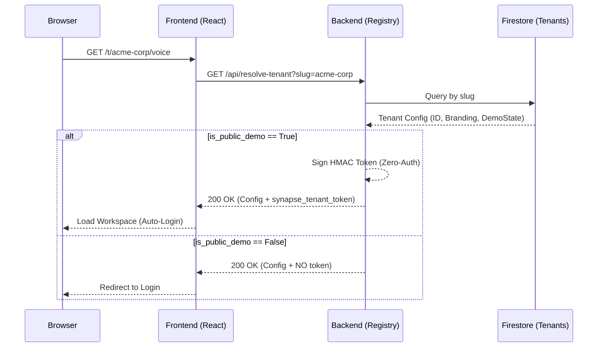

# Synapse Multi-Tenancy Architecture

Synapse implements a "Path-Based Atlassian" multi-tenancy model, optimized for Google Cloud and designed for both high security and frictionless investor demos.

## 1. Core Philosophy: "Dedicated Workspaces"
Unlike traditional systems that require a login before seeing anything, Synapse uses the URL as the primary context provider.

*   **Pattern**: `https://<root-url>/t/<tenant-slug>/<app>`
*   **Example**: `https://synapse.web.app/t/gemini-live-hackathon/voice`

This allows for absolute isolation while providing a premium, branded entrance for every client.

## 2. The Resolution Engine & Bootstrap Discovery
When a user visits a tenant path, the frontend (Hub or Voice UI) extracts the slug and calls the **Registry Resolution Engine**.

> [!NOTE]
> **Bootstrap Exceptions**: The endpoints `/api/tenants` (discovery picker) and `/api/resolve-tenant` (slug resolution) are public by design. These do NOT contain private PII or deal data; they serve only to map a public URL slug to a system-internal configuration.

## 3. Cryptographic Isolation
Security is enforced via **Signed Context Tokens** (similar to JWTs).

1.  **Tag Early**: Context is established during resolution.
2.  **Carry Everywhere**: The `synapse_tenant_token` is included in every API request (`Authorization: Bearer <token>`).
3.  **Enforce Everywhere**: FastAPI middleware validates the signature and timestamp. If the token is missing or forged, access is denied (401/403).

## 4. Operational Gating: Synapse Admin & Fail-Closed Security
Administrative actions (creating tenants, assigning slugs, rotating secrets) are strictly isolated.

*   **Endpoint**: `POST /api/tenants`
*   **Protection**: Requires `X-Synapse-Admin-Key`.
*   **Absolute Fail-Closed Protection**:
    *   If `SYNAPSE_ADMIN_KEY` is not set in the environment, the Admin and Hub APIs will **refuse to start**.
    *   Hardcoded fallbacks have been eliminated to prevent accidental insecurity in production.
    *   The `get_sync_status` endpoint in the Graph Generator is protected by the same key, preventing unauthenticated metadata leakage.

## 5. Hackathon / Investor "Zero-Auth" Flow
To ensure a "Perfect Run" for judges and investors:
1.  Dedicated slug: `gemini-live-hackathon`.
2.  `allow_public_demo` flag: Defaults to **`false`** for security; must be explicitly enabled per tenant.
3.  **Automatic Resolution**: The UI resolves the slug and obtains a signed token.
4.  **Result**: Instant access to grounded data with zero manual login required for designated demos.
