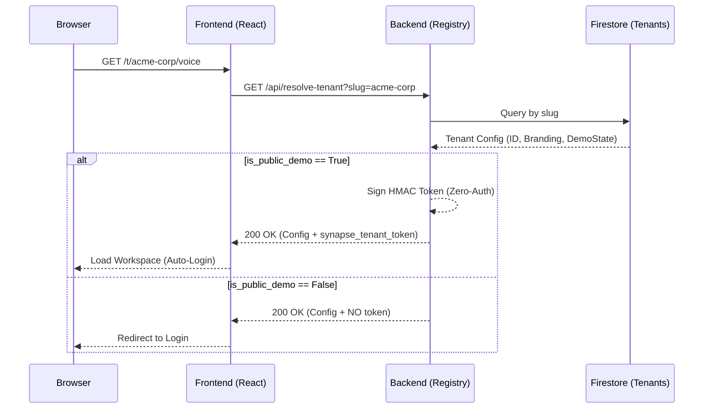

# Synapse Multi-Tenancy Architecture

Synapse implements a "Path-Based Atlassian" multi-tenancy model, optimized for Google Cloud and designed for both high security and frictionless investor demos.

## 1. Core Philosophy: "Dedicated Workspaces"
Unlike traditional systems that require a login before seeing anything, Synapse uses the URL as the primary context provider.

*   **Pattern**: `https://<root-url>/t/<tenant-slug>/<app>`
*   **Example**: `https://synapse.web.app/t/gemini-live-hackathon/voice`

This allows for absolute isolation while providing a premium, branded entrance for every client.

## 2. The Resolution Engine (`resolve-tenant`)
When a user visits a tenant path, the frontend (Hub or Voice UI) extracts the slug and calls the **Registry Resolution Engine**.

## 3. Cryptographic Isolation
Security is enforced via **Signed Context Tokens** (similar to JWTs).

1.  **Tag Early**: Context is established during resolution.
2.  **Carry Everywhere**: The `synapse_tenant_token` is included in every API request (`Authorization: Bearer <token>`).
3.  **Enforce Everywhere**: FastAPI middleware validates the signature and timestamp. If the token is missing or forged, access is denied (401/403).

## 4. Operational Gating: Nexus Admin
Administrative actions (creating tenants, assigning slugs, rotating secrets) are strictly isolated from the public tenant-facing surfaces.

*   **Endpoint**: `POST /api/tenants`
*   **Protection**: Requires `X-Synapse-Admin-Key` (Master Secret).
*   **Subdomain Management**: Slugs are unique and URL-safe, auto-generated from the tenant name if not specified.

## 5. Hackathon / Investor "Zero-Auth" Flow
To ensure a "Perfect Run" for judges and investors:
1.  Dedicated slug: `gemini-live-hackathon`.
2.  `allow_public_demo` flag set to `true`.
3.  The UI automatically resolves the slug and obtains a signed token on mount.
4.  **Result**: The user enters the app and sees grounded, isolated data immediately without ever typing a password.
