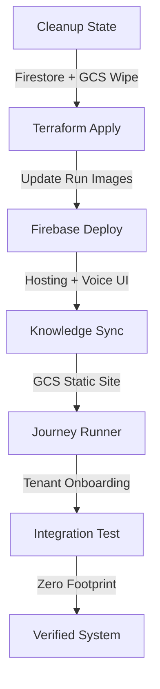

# Synapse — The Perfect Run (Maintenance & Recovery Guide)

This guide documents the **sequential verification pipeline** used to ensure 100% project readiness. Use this sequence after major infrastructure changes, feature deployments, or to reset a corrupted environment.

## 🛠️ The Pipeline Overview

The "Perfect Run" follows a 6-phase sequence that wipes state, redeploys infrastructure, seeds demo data, and runs a zero-footprint integration test.



---

## 🏃 Run the Pipeline

Execute the following command from the project root. This command is designed for **Powershell (Windows)** by default.

### The Atomic Command
```powershell
# 1. Purge DB 2. Deploy Infra 3. Deploy CRM 4. Seed 5. Test
py scripts/cleanup_db.py; .\scripts\deploy.ps1; .\scripts\deploy_crm.ps1; py scripts/journey_runner.py --hub_url (terraform -chdir=infra output -raw hub_url) --crm_url (terraform -chdir=infra output -raw crm_simulator_url) --graph_url (terraform -chdir=infra output -raw graph_generator_url) --backend_url (terraform -chdir=infra output -raw api_url); py scripts/test_pipeline.py --crm_url (terraform -chdir=infra output -raw crm_simulator_url) --graph_url (terraform -chdir=infra output -raw graph_generator_url)
```

---

## 🔍 Phase Details

### 1. Cleanup (`scripts/cleanup_db.py`)
- **Action**: Purges 13+ Firestore collections and resets GCS buckets (`skill-graphs`, `uploads`).
- **Why**: Ensures no residual data from previous sessions causes ID collisions or inconsistent states.
- **Includes**: `notifications`, `graph_jobs`, `crm_deals`, `tenants`, etc.

### 2. Infrastructure (`scripts/deploy.ps1`)
- **Action**: Builds production containers, pushes them to Artifact Registry, and runs `terraform apply`.
- **Outputs**: Generates critical URLs used by the downstream scripts.
- **Terraform Integration**: The scripts now fetch URLs dynamically via `terraform output` to avoid hardcoding errors.

### 3. Knowledge Sync (`scripts/journey_runner.py`)
- **Action**: Syncs the `knowledge-center/` directory to its dedicated GCS bucket and triggers the web crawler.
- **Fix (v2.6)**: Automatically switches to the public HTTPS URL for the Knowledge Center when running in production to ensure the crawler can reach the static site.

### 4. Demo Seeding (`scripts/journey_runner.py`)
- **Action**: Onboards the `ClawdView Demo` tenant and seeds 12+ demo deals from `crm-simulator/seed_data.py`.
- **Validation**: Checks for `integration_status=active` in Firestore to confirm the tenant is ready.

### 5. Integration Test (`scripts/test_pipeline.py`)
- **Action**: Creates a single test deal, waits for the Graph Generator ledger (ledger-based polling), and verifies entity count.
- **Cleanup**: Triggers a **zero-footprint** purge of only the test data upon completion.

---

## 🆘 Troubleshooting

### 400 Bad Request during Sync
- **Cause**: Crawler cannot reach the Knowledge Center URI.
- **Fix**: Ensure `kc_uri` is a public HTTPS URL (`https://storage.googleapis.com/...`). `journey_runner.py` now handles this auto-resolution.

### "Purging notifications" hangs
- **Cause**: Firestore timeout or massive collection size.
- **Fix**: Check your internet connection (ADC requires stable connectivity) or manually delete the collection in the GCP Console.

### 422 Validation Error in CRM
- **Cause**: Deal payload doesn't match the Pydantic schema in `crm-simulator`.
- **Fix**: Verify the `deal_payload` in `test_pipeline.py` matches the `DeepCrmDeal` model.

---

## 📈 Monitoring
Use the following command to track live logs during a run:
```bash
gcloud logging read "resource.type=cloud_run_revision AND severity>=INFO" --limit 50
```
